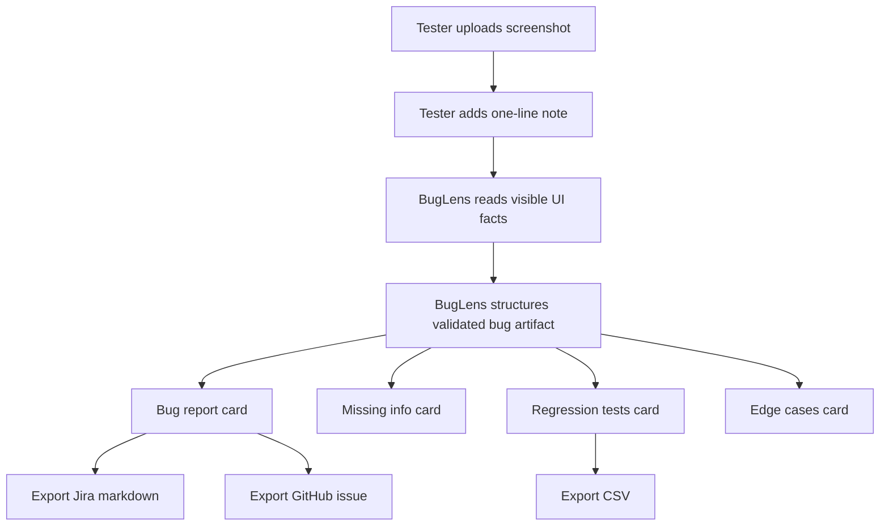
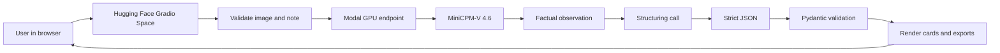
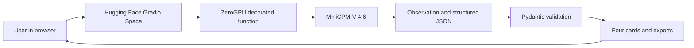
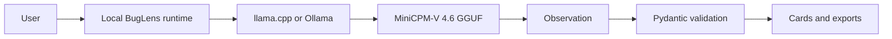
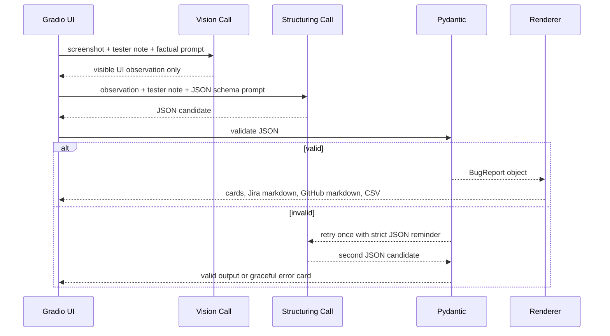
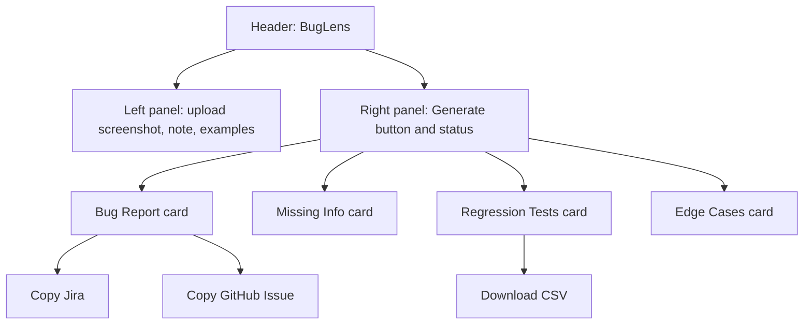

# BugLens Plan 03 - Architecture, Flows, And Product Shape

Research date: 2026-06-09

Purpose: define the system shape before implementation so the app feels engineered, not improvised.

## Product Flow



## Primary Technical Architecture

This is the recommended plan if Modal works by the Thursday gate.



Why this architecture:

- Meets the requirement that the app is a Gradio Space.
- Keeps the public app simple.
- Uses Modal enough to honestly qualify as Modal-powered.
- Lets the GPU model stay outside the frontend runtime.
- Reduces Gradio sticky-session risk because the Space remains the user-facing app.

## Fallback Technical Architecture

Use this if Modal is unstable.



Important ZeroGPU facts:

- Source: https://huggingface.co/docs/hub/spaces-zerogpu
- Use `@spaces.GPU` around GPU-dependent functions.
- ZeroGPU is compatible with Gradio SDK only.
- Personal hosting requires PRO; organization hosting requires Team/Enterprise.
- Daily quotas and queue priority matter.

## Optional Local-First Architecture

Only build this after the core submission works.



Why this matters:

- Needed for a credible Off the Grid claim.
- Needed for a credible Llama Champion claim if using llama.cpp.
- Not needed for the core win.
- Risky to prioritize before the Space is done.

## Two-Call Model Pipeline



Why two calls:

- Call 1 is perception: "What is visible?"
- Call 2 is product reasoning: "How should a bug ticket be shaped?"
- Separating the calls improves honesty, makes debugging easier, and gives you a clean demo explanation.

## Data Contract

Use one validated object as the app contract:

```text
BugReport
- title: string
- severity: enum[P1, P2, P3]
- component: string
- steps: list[string]
- expected: string
- actual: string
- missing_info: list[string]
- regression_tests: list[RegressionTest]
- edge_cases: list[string]

RegressionTest
- id: string
- desc: string
```

Do not allow UI code, export code, and model code to each invent their own shape. Everything should pass through this contract.

## Module Layout

```text
buglens/
  app.py
  requirements.txt
  README.md
  buglens/
    __init__.py
    schema.py
    prompts.py
    vision.py
    structure.py
    render.py
    examples.py
  modal_app.py
  theme.py
  examples/
    broken_payment.png
    login_error.png
    empty_dashboard.png
    mobile_overflow.png
  tests/
    test_schema.py
    test_render.py
    test_missing_info.py
```

Responsibilities:

| File | Responsibility |
|---|---|
| `app.py` | Build UI and wire events only |
| `schema.py` | Pydantic contract |
| `prompts.py` | Versioned prompts |
| `vision.py` | Screenshot to observation |
| `structure.py` | Observation to validated report |
| `render.py` | Jira, GitHub, CSV, card formatting |
| `modal_app.py` | Modal GPU endpoint |
| `theme.py` | UI theme and Off-Brand styling |
| `tests/` | Contract and rendering tests |

## UI Layout



Design requirements:

- The first viewport should be the actual tool, not a landing page.
- The four cards are the product.
- Missing Info must be visually prominent.
- Export buttons should be obvious and useful.
- Use example screenshots so judges can try it immediately.
- Avoid huge hero copy. This is an operational QA tool.

## Reliability Requirements

Must handle:

- No screenshot uploaded.
- Huge screenshot.
- Unsupported file type.
- Empty user note.
- Model timeout.
- Invalid JSON.
- Missing fields.
- Model guesses context it should not guess.

Graceful states:

- "I need a screenshot to inspect the UI."
- "The model returned invalid JSON. Try again or use the observation text."
- "I cannot determine browser, device, user role, or environment from the screenshot."

## Performance Targets

Acceptable for hackathon:

- First cold generation: under 60 seconds.
- Warm generation: under 20 seconds.
- UI response after validation: immediate.
- Exports: instant.

If slow:

- Use MiniCPM `downsample_mode="16x"` first.
- Switch to `4x` only for tiny text/OCR-heavy screenshots.
- Limit max tokens for observation and structure calls.
- Use short example screenshots.

